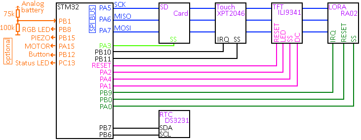
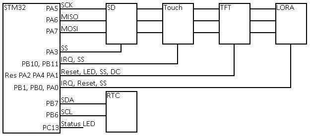

# Blue pill STM32F103CBT7 based LoRa boardcast* communication device.  
  
  
This broadcast device allows you to text-chat with other devices within range.  
  
*Note: Broadcasting means that without encryption, anyone who configures their settings to match yours  
can receive and read your messages. However, the settings that need to match include: Frequency,  
Spreading Factor, Bandwidth, and Sync Word(?). To communicate, all devices must have the same configuration.  
While privacy depends on you, you have the ability to manage these settings.  
  
You can communicate either in groups or via peer-to-peer (P2P) connections.  
  
   
  
# Version: sw v2.00, hw v0.9 update (Mar. 2025):  
  
(HW compatibility: from pre v2.xx changed by one pin: PB1 - > PB9, PB1 analog BAT-in now)  
  
  
|||
|---|---|
|||

  
This custom PCB was designed as a shield for the ILI9341 2.4" LCD module and include such HW:  
- Piezo beeper.  
- Vibrating motor.  
- Onboard serial connector for GPS (not supported by software yet).  
- Button and RGB led.  
- BMP280 (not supported by software yet).  
  
(PCB v0.9 is a beta version. It works fine but needs some qol update)  
  
   
To build yourself [see schematic.](pics/full_sch.png)  
   
  
An SD card is *mandatory*!  
Your personal ID on this network is based on the SD card’s serial number (xx^xx+xx^xx = xxxx).  
The SD card also contains your settings file, including touch positions, as well as logs with additional  
information for every packet: signal-to-noise ratio (SNR), date, time, welcome message, and more.  
It's similar to a SIM card's IMEI, primarily used to "color" your messages.  
  
The log file is created daily and is named using the format 'DDMMYYYY'.  
  
No MCU EEPROM, MCU serial number, or LoRa module serial number are used.  
Every device is identical to one another until your SD card is inserted!  
So, to erase all traces, keep the card off the device or destroy.  
  
   
  
- Builtin quarter wave antenna length calculator. 1/4 wave is a basic/starter antenna.  
- Builtin realtime RSSI indicator in the [Info] menu.  
- Builtin LoRa datarate calculator.  
- Hardware button click - toggle white LED.  
- To enter menu - double click hardware button or send an empty message. ([OK] button).  

    
  
For the best settings use "**LoRa Modem Calculator Tool**".  
  
   
  
Packet forming:  
  
|v1st|v2nd|ttl|contr|ID|msg text|
|---|---|---|---|---|---|
|8 bytes|8 bytes|1 byte|1 byte|4 bytes|1-49 bytes|
|TBD|TBD|TBD|TBD|.....|.....|
|00000000|11111111|x|y|All:|71 bytes max|
  
   
  
**Using as serial terminal with putty or any else (@115.2):**  
On transmit, parse line: <u>22.03.25  23:36:30  >>> 00000000-11111111-x-y-0602:test msg 01:</u>  
On receive, parse this: <u>22.03.25  23:36:56  <<< 00000000-11111111-x-y-5D1F:reply msg 01:RSSI=-50:SNR=8.50:FE=4294</u>  
"<<<" means RX, ">>>" TX. Chars "-" and ":" are separators. Here "0602" and "5D1F" are IDs.  
To send packet via serial just send "msg text". Date, time, your ID and other info will be auto added in transmission.  
  
&nbsp;  
  
<table>
<tr><th>Hardware</th><th>Pins</th></tr>
<tr><td>

|Name|Pin|  
|---|---|
|TFT reset|reset|
|TFT LED|PA2 |
|TFT SS |PA4 |
|TFT DC|PA1|
|SD SS|PA3|
|Touch SS|PB11|
|Touch irq|PB10|
|LoRa irq|PB9|
|LoRa reset|PB0|
|LoRa SS|PA0|
|LED|PC13|
|Analog BAT in|PB1|
|RGB LED|PB8|
|PIEZO|PB15|
|MOTOR|PA15|
|Button|PB12|

</td><td>

</td></tr> </table>
   
  
<u>TFT, SD, LoRa and Touch SPI:</u> SCK - PA5, MISO - PA6, MOSI - PA7.  
<u>i2c DS3231 RTC:</u> SDA - PB7, SCL - PB6.  

Don't have to burn any bootloader. SWD is here!  
After flashing the MCU connect TFT and you'll be taken through setup process.  
  
**Short Boot0 and Boot1 to ground!**  

  
<u>Minimum parts:</u>  
- Blue pill (128k+ only) or any other compatible stm32 devboard.  
- ili9341 (320x240) TFT with touch and SD card (2.2, 2.4 or 2.8").  
- DS3231 RTC with 3v battery.  
- RA-02 LoRa module.  
- Antenna.  
  
  
<u>Minimum parts for PCB v0.9:</u>  
- STM32F103CBTx, LQFP-48.  
- RA-02 LoRa module, Ai-Thinker-Ra-02.  
- DS3231MZ, SOIC-8 RTC.  
- 3v battery holder, BatteryHolder_Keystone_1060_1x2032.  
- SPX3819M5-L-3-3, 3.3v LDO, SOT-23-5.  
- TP4057, SOT-23-6.  
- USB connector, USB_Micro-B_Amphenol_10104110_Horizontal.  
- Power switch, SW_SPDT_PCM12 (MK-12C02)(EG1215AA)(PCM12SMTR).  
- Push buttons, 434133025816.  
- 8MHz, Crystal_SMD_5032-2Pin_5.0x3.2mm.  
- 32kHz, Crystal_C26-LF_D2.1mm_L6.5mm.  
- Antenna.  
- C, R, LEDs... 0805_2012Metric.  
  
  
[See schematic.](pics/full_sch.png)  
  
&nbsp;  
Some other fotos, loading screen.:  
  

  
And interface:  
|||
|---|---|
|||
|||
  
Arduino and PUTTY interfaces:  

  
&nbsp;  
&nbsp;  
&nbsp;  
&nbsp;  
##########################################  
&nbsp;  
Left here for historical information only:  
&nbsp;  
##########################################  
&nbsp;  
&nbsp;  
&nbsp;  
&nbsp;  
  
# VERSION 1.1 update (23.05.21):  
Since v1.1 you don't need to calibrate touch positions anymore. Not even compile the sources. Wire up all together.  
Burn _bin_ provided (STLink or any) then insert formatted SD card and setup will begin.  
You will be prompted to move stylus over corners until counter became 0.  
Just follow the instructions on the screen.  
Then setup will create "config.txt" file on SD root.  
First four lines is calibrated X-Y positions. Do not change!  
Others are for LORA setup. Changing those values leads to communication variants:  
  
LoraFreq 137000000 to 525000000  
TxPower 1 to 20  
SpreadingFactor 6 to 12  
SignalBandwidth 7800 to 500000 (7800, 10400, 15600, 20800, 31250, 41700, 62500, 125000, 250000, 500000)  
CodingRate4 5 to 8  
SyncWord  1 to 254  
Crc 0 or 1  
  
Two or more units with the same settings only will communicate.  
To repeat setup process delete settings.txt or command "resetconfig" then send.  
  
+v1.1 Much more debug information printed on screen during boot or setup.  
+v1.1 Current LORA settings are displayed at startup.  
+v1.1 To set time and date use command  "TssmmhhWDDMMYYYY" (ie T003201123052021) W = 1 - Sunday,  
2 - Monday, and so on. Then press send.  
+v1.1 Here is _LoRa-Heltek.ino_ for HELTEK LoRa32 (esp32) board. This provides compatible hardware for communication tests.  
Already assembled board. Thus you can set up only one LoRa_messenger and test settings or range with heltek.  
Software prints last received message on OLED and sends packets on PRG button press.  
  
  
All messages are logged to SD card in 'current date's filename' (ie 29092019).  
Received messages are logged to SD with their RSSI, SNR and FreqErr values for better debuging.  
Log line example:  
23.02.20  04:10:43  Rx: Hello AAA No:0 >>> RSSI: -55 SNR: 11.00 freqErr: 582  
  
How far you can communicate? It's complex question depends on so many parameters. There is no proper answer.  
Some peoples achived thousands of kilometers within line of sight with directional antenna. The last word:  
everything depends on the right choosen antennas. Current setting are set for maximal range.  
  
Hardware connections:  
  
TFT, SD, LoRa and Touch SPI:  
SCK        - PA5  
MISO       - PA6  
MOSI       - PA7  
Other:  
TFT reset  - reset  
TFT LED    - PA2 (30sec timeout)  
TFT SS     - PA4  
SD SS      - PA3  
Touch SS   - PB11  
TFT DC     - PA1  
Touch irq  - PB10  
LoRa irq   - PB1  
LoRa reset - PB0  
LoRa SS    - PA0  
i2c:  
DS3231 SDA    - PB7  
DS3231 SCL    - PB6  
  
  
  
  
  
  
  
## How to setup proper touch position:  
  
UPD v1.1: Built-in calibration and time setting are implemented.  
Obsolete:  
Start programm and enter "calibON" command or modify line 256.  
Touch anywhere and see how far touched point being painted yellow.  
Adjust in code TS_MINX, TS_MINY, TS_MAXX and TS_MAXY and recompile. :)  
  
Set DS3231 time and date with sketch from DS3231 library.  
Please use only libraries mentioned in the code (ds3231.h and XPT2046_touch.h).  
  
  
    
## ToDo:  
  
- Adjust clock and date via interface command. DONE! since v1.1  
- Set\show freq, SpreadingFactor, Bandwidth, CodingRate and syncWord via config file. DONE! since v1.1  
- Makeup code to use 2D messages array instead of 10 arrays :) DONE! since v2.00  
- Better tr\rx messages color marking with alligning to both sides (SMS style). DONE! since v2.00  
- Show battery voltage on tft. DONE! since v2.00  
- Vibrate\beeper on msg receive. DONE! since v2.00  
- GPS support. UNDER Q  
- BMP280 pressure sensor support. UNDER Q  
- Flash light. DONE! since v2.00  
- SOS button. Sends special packets etc. DONE! since v2.00  
